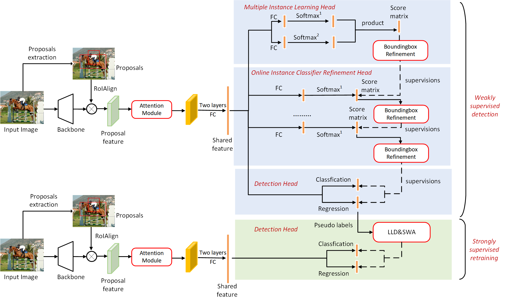

<div align="center">
<h1>[Neuro Computing 2024] Refining and reweighting pseudo labels for weakly supervised object
detection</h1>
</div>

<div align="center">
  
</div><br/>

## Notes

This is a Office implementation of the **Refining and reweighting pseudo labels for weakly supervised object** [ScienceDirect](https://www.sciencedirect.com/science/article/pii/S0925231224001589).

## Get Started

#### 1. Please follow these steps to create environment.

a. Create a conda virtual environment and activate it.

```shell
conda create -n wsod python=3.7 -y
conda activate wsod
```
b. Install other packets as followings.

- numpy                1.21.6
- opecv-python         4.7.0.72
- torch                1.6.0
- torchvision          0.7.0
- tensorboard          2.11.2

#### 4. Start Training.

##### 4.1 The first stage training.
```shell
sh train.sh
```

**Note that For VOC2007 and VOC2012, please use vgg16_voc2007_more.yaml and vgg16_voc2012.yaml respectively. Regarding the main configurations of the attention module and label optimization part, please note the CDBLOCK field and SUP field in the configuration files.** 

##### 4.2 The second stage training.
```shell
sh train_fast_rcnn.sh
```

**Note that The configuration files used in this part are vgg16_voc2007_fast.yaml and vgg16_voc2012_fast.yaml. The main codes for dynamic partitioning and weight adjustment are located in lib/core/loss_helper.py, and the specific parameter configurations can refer to the paper.** 

#### 5. Start Test.

##### 5.1 The first stage Test.

```shell
sh test.sh
```
##### 5.2 The second stage Test.

```shell
sh test_fast.sh
```
**Note that when using the trainval dataset as the test set, the corloc localization accuracy metric is used by default, and when using the test dataset as the test set, mAP50 is used as the evaluation metric.** 

## Checkpoints

Weakly supervised stage weights VOC2007 [model_step139999.pth](https://drive.google.com/file/d/1gSUgdH1MdPZjGreUa8COnuem5pUTp8iA/view?usp=drive_link).

Weakly supervised stage weights VOC2012 [model_step299999.pth](https://drive.google.com/file/d/1gSUgdH1MdPZjGreUa8COnuem5pUTp8iA/view?usp=drive_link).

Strongly supervised stage weights VOC2007 [model_step18749.pth](https://drive.google.com/file/d/1gSUgdH1MdPZjGreUa8COnuem5pUTp8iA/view?usp=drive_link).

Strongly supervised stage weights VOC2012 [model_step37499.pth](https://drive.google.com/file/d/1gSUgdH1MdPZjGreUa8COnuem5pUTp8iA/view?usp=drive_link).
